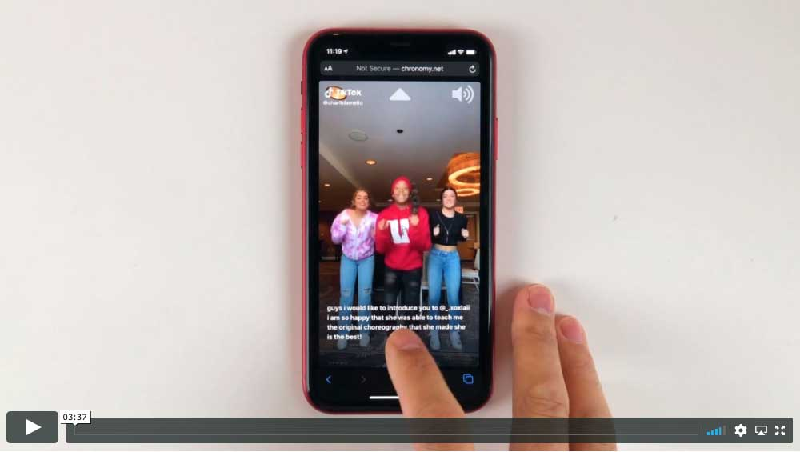
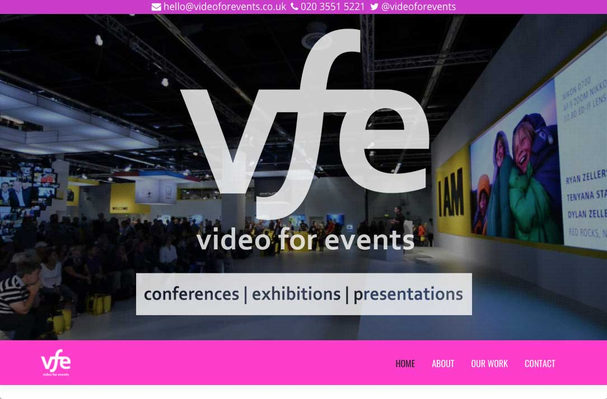
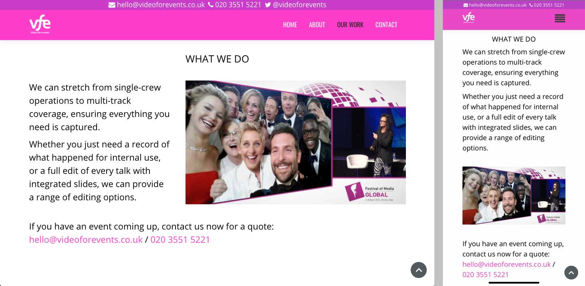
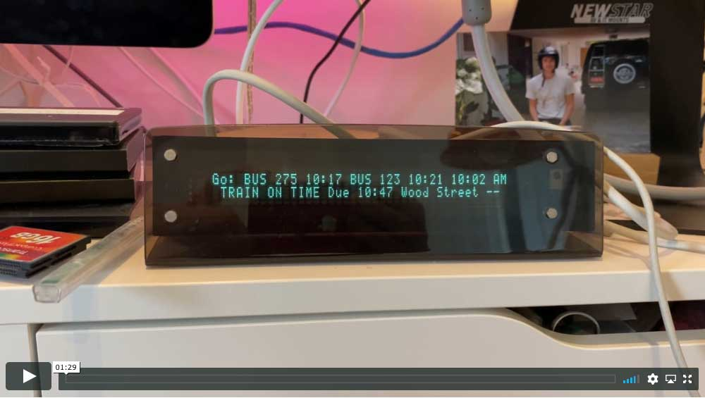

<h1 align="center">Will Head</h1>

  

[Projects](#projects) |
[Skills](#skills) |
[Education](#education) |
[Experience](#experience) |
[Interests](#interests)

I'm a web developer with commercial experience, having worked in technology for my whole career: creating it for deployment in a live environment, writing about it for magazines and websites, and explaining it in videos that have been watched over 25 million times.

I've run my own company for many years, so I can to manage projects from inception to completion; working autonomously when required to assembling and managing a team, to successfully deliver large projects on time and on budget.

In addition to project management I was responsible for delivering all technical projects for the company.

#### Key Skills
- Languages: Ruby, Javascript, Java, PHP, C++, HTML, CSS
- Frameworks: Rails, Sinatra, React
- Datastores: MySQL, PostgreSQL
- Testing: RSpec, Capybara, Jest, Jasmine, Cypress
- Tools: Git, Travis, RuboCop, ESLint, Bash

## Projects

### Chronomy

The goal of the project is to provide a curated playlist of [TikTok](https://www.tiktok.com/) videos.

Created as part of [Makers Academy's](https://makers.tech/) Web Developer Bootcamp, it involved delivering a team project from scratch in two weeks. I drove the specification of the project and was heavily influential in its design and architecture.

TikTok is an original and creative new media format, but not all the content on the platform is suitable for a young audience. Chronomy lets you create a safe, curated playlist of TikToks that are age-appropriate to be shared safely.

The app consists of a Ruby on Rails backend, deployed automatically to [Heroku](https://chronomy.herokuapp.com/), and a React frontend, hosted on [Surge.sh](http://chronomy.net/).

The app is deliberately locked down to avoid inadvertent sharing of unscreened content. An example shared playlist, optimised for mobile viewing, can be viewed here:  
http://chronomy.net/view/18dc1213-07f2-4b43-9c4f-c254d71796bf

Playlist URLs are deliberately long to avoid accidental discovery of other users' playlists, since different people will have different standards of what they consider suitable.

The backend repository can be found here:  
[https://github.com/will-head/chronomy-api](https://github.com/will-head/chronomy-api)

The frontend repository can be found here:  
[https://github.com/will-head/chronomy-web](https://github.com/will-head/chronomy-web)

To see the app in action, click the video below:  

### Video for Events website

[Video for Events](https://videoforevents.co.uk/) is a single page website running on Wordpress with a heavily customised theme.

It's fully responsive, so suitable for both desktop and mobile visitors and adheres to modern web standards.

In order to ensure fast load times, it employs intelligent caching and is served via [Cloudflare's](https://www.cloudflare.com/) global CDN.

It includes a web application firewall to protect against malware attacks.  

### Personal Travel Planner

I have a Computer Science degree, so I've always turned to my coding skills to solve a problem or scratch an itch.

One such project was a custom bus and train time display for my office.

We moved to a location that was served by two different bus routes and a train station, so I used the [Transport API](https://www.transportapi.com/) web service to get the latest real-time bus and train times and then calculate which I should use, based on walking distance to the stop and how long the journey would take.

I then re-purposed a [Slimp3](http://wiki.slimdevices.com/index.php/SLIMP3) MP3 player with a wonderful VFD screen that could display RSS feeds and hacked it to display a rolling personal timetable. I also had to implement caching to ensure I didn’t exhaust the daily limit of API calls you’re allowed on a free account.

To see a demo of my Personal Travel Planner, click the video below:  

## Skills

### Key Skills
- Languages: Ruby, Javascript, Java, PHP, C++, HTML, CSS
- Frameworks: Rails, Sinatra, React
- Datastores: MySQL, PostgreSQL
- Testing: RSpec, Capybara, Jest, Jasmine, Cypress
- Tools: Git, Travis, RuboCop, ESLint, Bash

### Soft Skills

#### Project Management

As a company director, I manage all projects from start to finish. The size can range from a single person to a small team.

I'm fully responsible for delivering projects on time and on budget in order to ensure maximum profitability - it literally affects my bottom line.

I've worked with startups that use agile methodology and applied agile techniques where applicable to my business, creating a more responsive and iterative relationship with the client.

#### Technical Writing

I've written for over thirty international publications, on topics as diverse as programming, internet culture, comprehensive hardware reviews and in-depth software features.

I can explain complex topics in an understandable and entertaining way. My writing is both compelling and informative, suitable for both experienced readers and those new to the subject alike.

#### Growth Mindset

I love learning new skills, and if I don't know how to do something I see it as an opportunity to learn not a disadvantage.

I embrace self-led learning and am constantly looking for new ways to enhance my skills and abilities, whether it's improving existing workflows to increase efficiency, mastering new skills to expand my creative output or learning new programming languages.

I also enjoy sharing new skills and techniques (when asked...) to help others learn and develop.

## Education

### Makers Academy

- Web Developer Bootcamp
- OOP, TDD, MVC, DDD
- Agile/XP
- Ruby, Rails, JavaScript, React
- RSpec, Capybara, Jest, Jasmine, Cypress
- RuboCop, ESLint
- CI/CD, Travis
- Git, GitHub

### Warwick University

- Computer and Business Studies BSc
- Third year project: Visual Basic Forms for the PalmPilot  
  - Automatic conversion of Visual Basic forms into PalmPilot executables
- Courses include: Software Engineering, Database Design, Logic, Object Oriented Programming, History of Computing, Marketing Communications and PR

### Other Training

- Design and Launch an Online Education Course  
- SEO for SEO Beginners  
- Sandler Sales Training  
- Apple: Final Cut Journalist Course  
- Adobe: Mastering Premiere for Journalists  
- Total Training: Premiere Pro & After Effects  
- The Editor as People Manager Course  
- Rewriting and Subbing Specialist Copy Course  
- Features Writing Course  
- Libel Training Course  

## Experience

### Founder – Fixation Video  (02/2009 – Present)
-	Fixation Video specialises in telling stories through editorial video
-	Major international clients: Sony, Nikon, Wimbledon, WIRED, Bloomberg, Philips, Samsung, Glenfiddich, Three, Vodafone, MediaTek, ASUS and Tesco Mobile
-	Content for YouTube, Facebook, podcasts, Vine, Twitter, Instagram
- 25 million total video views to date
-	Full project execution, from concept and development to production and delivery
-	Skills: idea generation, research and development, production, resourcing, working with external creators, editing, client management, measurement and analytics

### Creator in Residence - Tick Done  01/2019 – 07/2019
-	Working with a startup micro-video platform to empower a billion people with a million new skills.
- Researching subject areas suitable for the online learning platform
-	Scripting, filming and editing educational content
-	Working with the community lead to devise content to engage the community
-	Inspiring brands to embrace the platform

### Freelance Technology Journalist  07/2006 – 02/2009
-	Working for both online and print publications covering written, audio & video pieces
-	Titles include: The Guardian, T3, The Register, CNET, Computer Active, Shiny Media, MacUser, Computer Shopper, PCW, VNUnet and Web User
-	Video coverage for The Register has over 2.8 million views
-	Work includes: news, reviews, video reports, features, podcasts and blogs

### Group Online Editor – IDG Communications  01/2006 – 07/2006
-	Managing all of IDG's consumer websites: PC Advisor, Macworld and DigitalArts
-	Project managing website relaunches
-	Ensuring community features were being used to best advantage
-	Regular competitor monitoring and analysis
-	Researching and preparing briefs for new launches

### Deputy Editor – PC Advisor magazine  09/2005 – 01/2006
-	Managing all editorial staff and a team of freelance writers
-	Ensuring the magazine was up to date, relevant to readers, accurate, entertaining and written in a plain English style
-	Fully responsible for the PC Advisor website (www.pcadvsior.co.uk)
-	Oversaw a major redesign of the PC Advisor website covering design, function, content and backend
-	Writing a regular monthly column about the internet plus features, news, reviews and blogs

### Reviews Editor – PC Advisor magazine  05/2002 – 09/2005
-	Responsible for commissioning and editing the reviews and top ten chart sections, managing a team of internal and freelance writers
-	Introduced a new section to add authority, character and humour
-	Oversaw a major redesign of the reviews section covering style, presentation, work practice and staff deployment

Further employment details available upon request

## Interests

Multimedia projects including video editing, cinemagraphs, podcasts, music creation, web design, literature and DJing.
